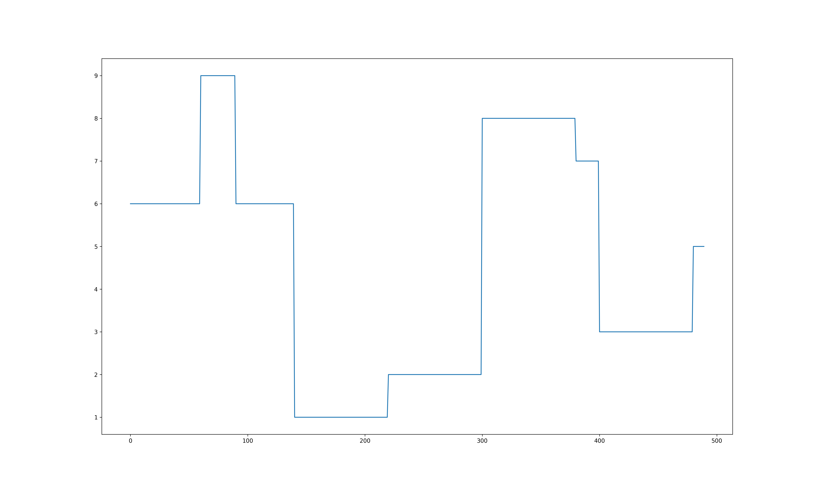
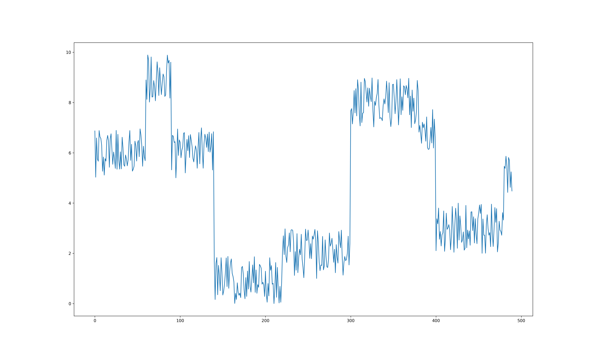
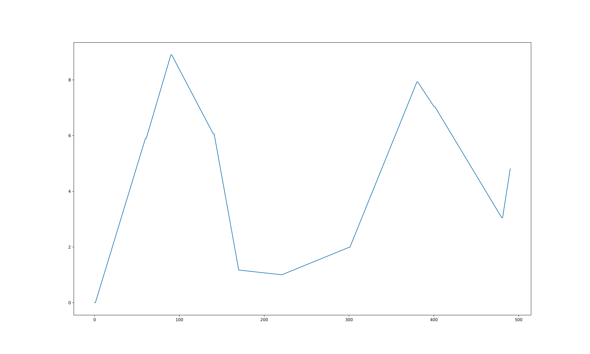
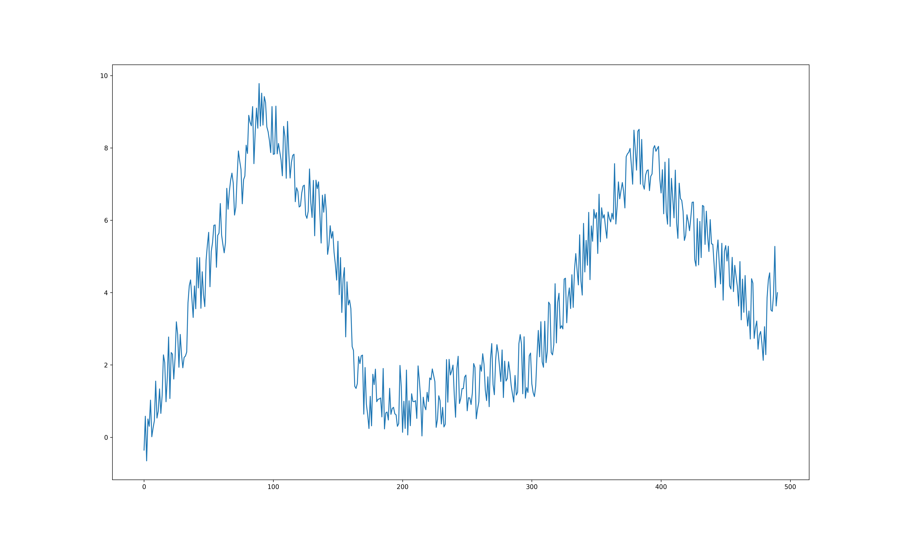
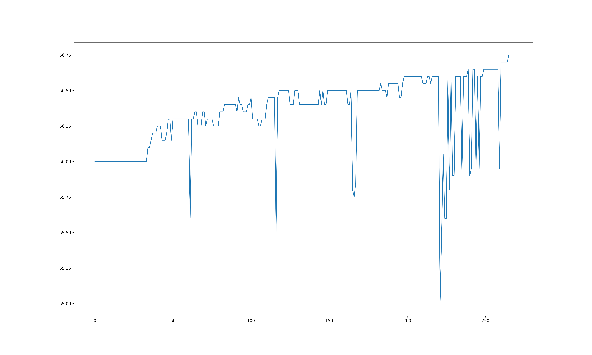

# Deustche Bank Capstone Project - L1 Filter for High Frequency Signal
This repository was created for creating a L1 filter to purify the high frequency trading signals.
Several modules were included in this repo for different usages. 

## Codes Description
* [codes/simulation.py](https://github.com/lkqllx/High-Frequency-Signal-Filtering/blob/master/codes/simulation.py)
This module was created for simulating high frequency signal randomly to validate the algorithms robustness and 
avoid over-fitting.

    where one function and one class were included:
    
    -> **func** noise_signal: to add noise in original data
    
    -> **class** RandSignal: to create step or high frequency like signal
* [codes/visualization.py](https://github.com/lkqllx/High-Frequency-Signal-Filtering/blob/master/codes/visualization.py)
This module was created for visualizing the line plot of signals from csv or list format

    where one class was included:
    
    -> **class** VisualTool: to plot real or simulated signals
    
    SAMPLE
    + clean step signal
    
    + noised step signal
    
    + clean simulated signal
    
    + noisy simulated signal
    
    + 0005 HK signal
    
  
## Data Description
Inside the `data/` directory, there are four datasets representing the tick data of `0005.HK, 0700.HK, 2330.TW`
and an unprocessed raw data `trades.csv`. 

