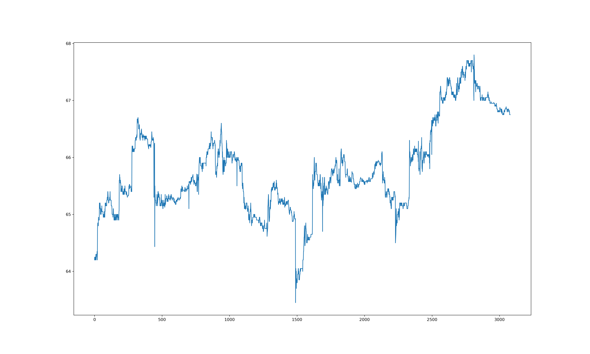
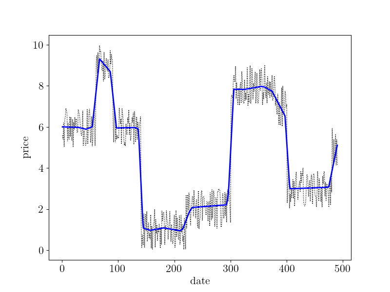
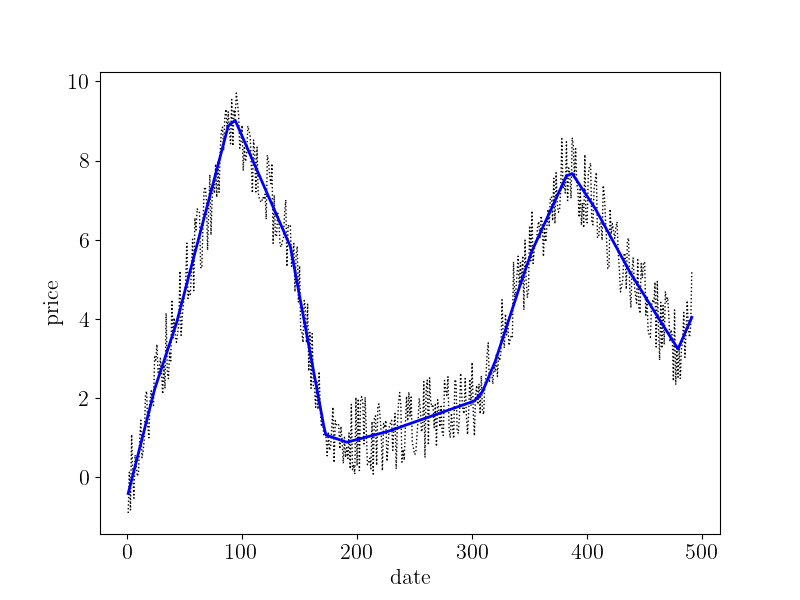
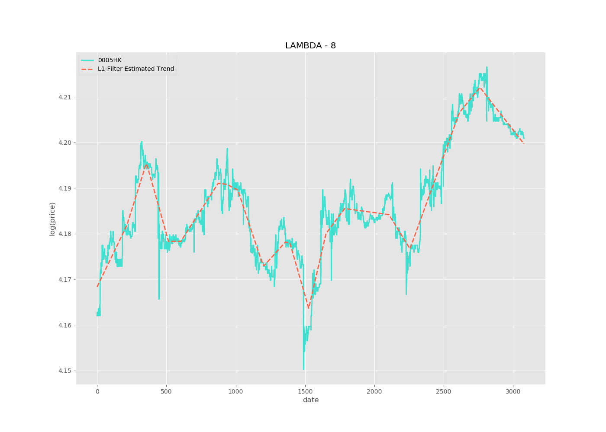

# Deustche Bank Capstone Project - L1 Filter for High Frequency Signal
This repository was created for creating a L1 filter to purify the high frequency trading signals.
Several modules were included in this repo for different usages. 

## Codes Description
* [codes/simulation.py](https://github.com/lkqllx/High-Frequency-Signal-Filtering/blob/master/codes/simulation.py)
This module was created for simulating high frequency signal randomly to validate the algorithms robustness and 
avoid over-fitting.
    
        -> def noise_signal: # to add noise in original data
        
        -> class RandSignal: # to create step or high frequency like signal
    
    
* [codes/visualization.py](https://github.com/lkqllx/High-Frequency-Signal-Filtering/blob/master/codes/visualization.py)
This module was created for visualizing the line plot of signals from csv or list format
    
        -> class VisualTool: # to plot real or simulated signals
    
    ### SAMPLE OUTPUT
    #### Clean Step
    
    #### Noised Step
    
    #### Clean Fake
    
    #### Noised Fake
    
    #### 0005 HK signal
    
 
 * [codes/filter.py](https://github.com/lkqllx/High-Frequency-Signal-Filtering/blob/master/codes/filter.py)
 This module was created for construction of different types of filters.
 
    -> class Filters: # to build filters like l1 or l2.
    
    ### SAMPLE OUTPUT of L1 Filter
    
    #### Filtered Step Signal
    
    
    #### Filtered Fake Signal
    
    
    #### Filtered 0005 HK
    
 
## Data Description
Inside the `data/` directory, there are four datasets representing the tick data of `0005.HK, 0700.HK, 2330.TW`
and an unprocessed raw data `trades.csv`. 
